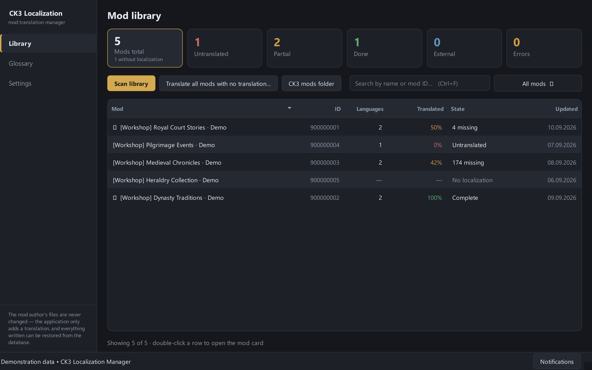
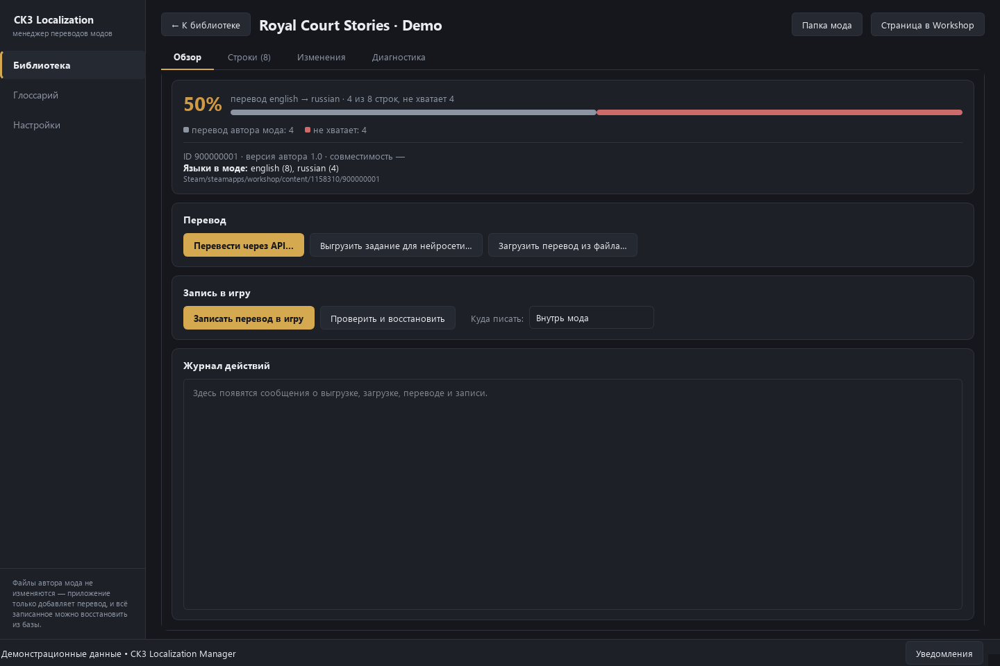
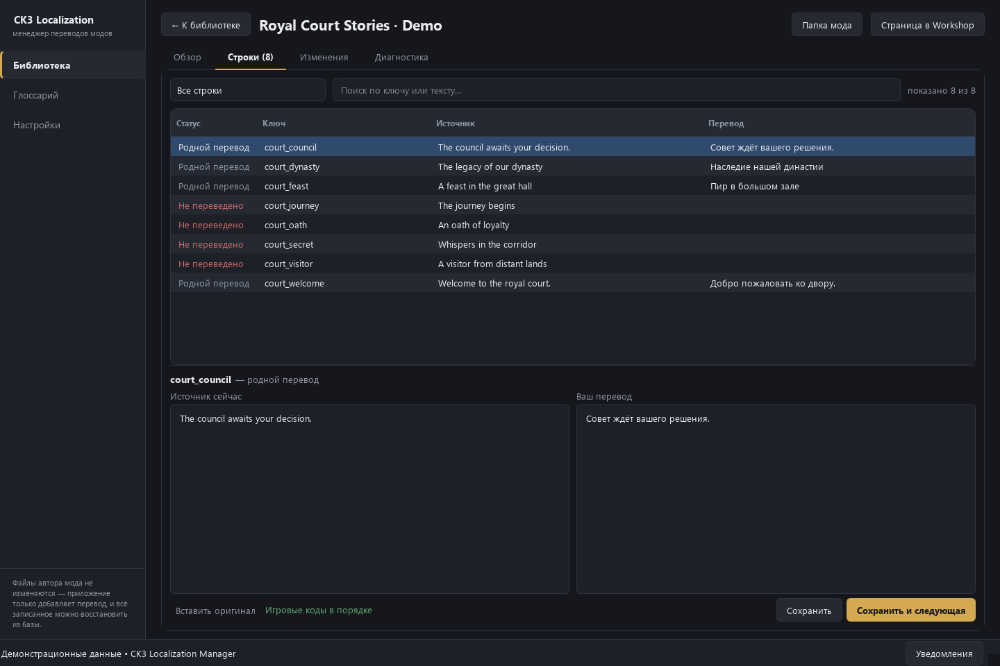
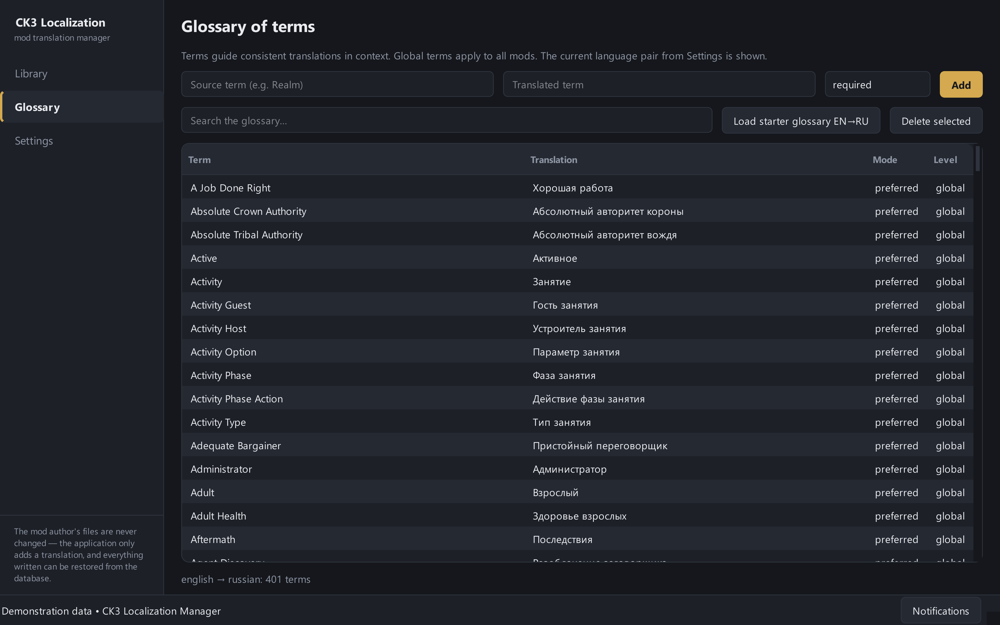
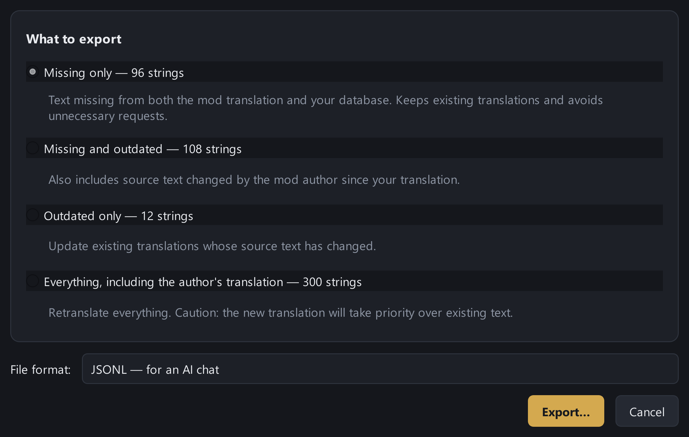

# CK3 Localization Manager

**Supported interface languages: English, Russian, German, French, Spanish, Simplified Chinese, and Korean.**

### More stories in your language.

Translate Crusader Kings III mods, keep up with changes and restore your work after updates.

[**Download the app**](https://github.com/rqkeqq-ui/ck3translate/releases) · [Steam Workshop Database](https://steamcommunity.com/sharedfiles/filedetails/?id=3799038632) · [User guide](docs/USER_GUIDE.en.md) · [Report an issue](https://github.com/rqkeqq-ui/ck3translate/issues) · [Русский](docs/README.ru.md)

## Your favorite mod just updated. Keep its translation up to date, too.

CK3 Localization Manager brings mod translation into one place: find missing text, translate what you need and restore files created by the app. For players who want to understand every event, and translators who want to keep their progress through every update.

### Your whole library at a glance

Scan Steam Workshop subscriptions and local CK3 mods together. Choose your local mod folder in Settings; local mods also work without Steam. Find untranslated mods, incomplete localizations and separate translation mods. Coverage measures matching localization keys; translation quality still needs a human review.

### Translate your way

Export a JSONL task with a ready-to-use prompt, send it to ChatGPT, Claude, DeepSeek or another chat, then import the result. No API key is needed for this workflow; free access depends on the chat service. Or connect Google, DeepL, Yandex, Claude and OpenAI-compatible APIs directly in the app. Provider pricing and limits apply. XLIFF exchange is available for translation tools.

### Keep the work you have already done

The app writes its own translation files while preserving the mod author's original files. Write into the mod directory or create a separate patch mod. Local history, backups and change tracking help restore app-generated translations after Steam updates. Translate new or changed source text separately.

### Consistent terms. Game syntax under control.

Review the original and translated text side by side. A bundled glossary of **400 concepts in six translation languages** (2,400 English → Russian, German, French, Spanish, Simplified Chinese and Korean entries) and translation memory help keep your terminology consistent; vanilla references can be extracted from your installed CK3. Token validation detects missing variables, formatting tags and commands before writing. Always review the text and test it in game.

## See it in action

| Mod overview | Translation editor |
| --- | --- |
|  |  |
| **Glossary** | **Export for an AI chat** |
|  |  |

Actual application screens, shown in English with fictional demonstration mods. Download the full-resolution PNGs from [the gallery](docs/images).

## Get started in minutes

1. Open [Releases](https://github.com/rqkeqq-ui/ck3translate/releases) and download the archive for your operating system.
2. Extract the **entire archive**. Run `CK3LocalizationManager.exe` on Windows, `CK3LocalizationManager` on Linux, or the `.app` on macOS. No Python installation required.
3. Choose your languages and scan your library. Set the Steam or local mod folder in Settings if it is not detected automatically.
4. Open a mod, translate missing text, review the result and write your translation.

Windows x64, Linux x64 and macOS Apple Silicon are built separately. Check the release notes for available downloads and platform limitations. [User guide](docs/USER_GUIDE.en.md) · [Руководство на русском](docs/USER_GUIDE.ru.md).

## Community Database — growing with the community

An optional dataset for links between mods and their translations, shared terminology and processing rules. The app includes the 400-concept multilingual glossary even without a subscription. Workshop supplies community data updates; translation links and mod rules are currently empty. Share verifiable suggestions through Issues.

**[Subscribe to the Community Database on Steam Workshop](https://steamcommunity.com/sharedfiles/filedetails/?id=3799038632).** Wait for Steam to download the files, then open the app. If the database is missing, the startup reminder lets you open Workshop, check the download or continue without it. Subscribing is optional.

Subscribing downloads data, not the desktop application. **Do not enable the database in a playset.**

## Stay up to date

The app checks for new stable releases at startup. **Update** opens the GitHub release, **Next time** postpones the reminder, and **Skip this version** hides that version only. You can also check manually in Settings. Download and extract the complete new archive; your saved translations stay in your user data folder.

## Free and open source

The app is free and licensed under [MIT](LICENSE). Translation services may charge separately. This project is not affiliated with Paradox Interactive or Valve. Dependencies retain their [own licenses](docs/THIRD_PARTY_NOTICES.md).

[Support development](docs/SUPPORT.md) · [User guide](docs/USER_GUIDE.en.md) · [Описание на русском](docs/README.ru.md)
